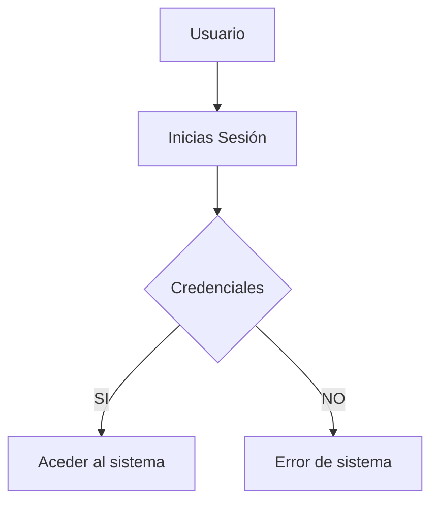
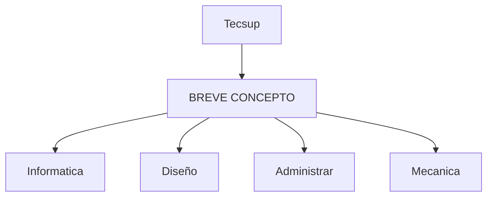

# Título importante
Aprendiendo *markdown* en las clases del profesor Luis pallin

## Subtitulo 1
Aqui veremos cómo formatear diferentes **tipos de texto**

## Subtitulo 2
Podremos conocer diferentes tipos de formato de textos usando ~Markdown~.

### Creando Hiperv....
[Google](https://www.Google.com)
[Tecsup](https://www.tecsup.edu.pe)

## Colocar imágenes


## Funciones 
- [X]
- [X]
- [ ]
- [ ]

## Creando tabla
| Lenguaje de programación | Creador | 
| -------------------- | -------------- |
| Java | James cosling |
| PHP | Rasmus Lerder |
| Python | Guido van Rossum |

## código
```--html
<H1>Hello word</h1>
```

```css
body{
    background:"red";
}
```
```java
public class Gitbash {
    public static void main(String[] args) {
        System.out.println("Hello world");
    }
}
```
```JavaScript
    document.body.innerHTML = 
        "<h1> Hola mundo desde JS </h1>";
```

## Mermaid Diagramas


## Diagrama de tectup
